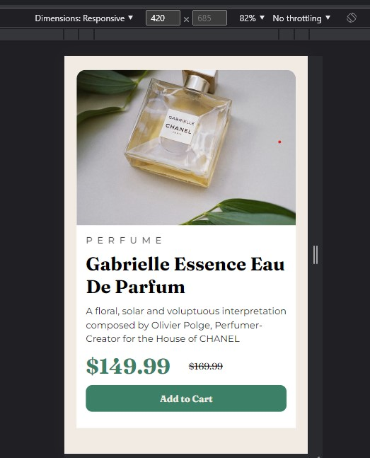
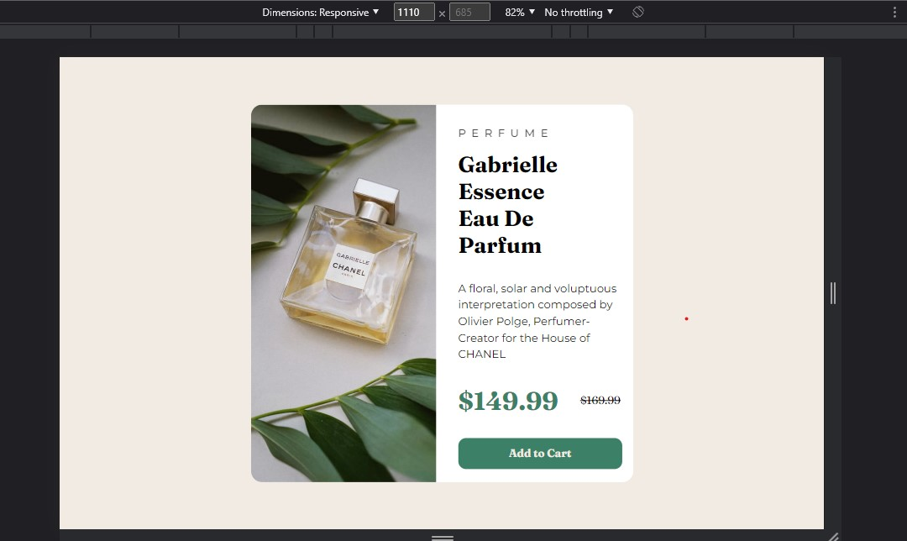

# Frontend Mentor - Product preview card component

# Frontend Mentor - Product preview card component solution

This is a solution to the [Product preview card component challenge on Frontend Mentor](https://www.frontendmentor.io/challenges/product-preview-card-component-GO7UmttRfa). Frontend Mentor challenges help you improve your coding skills by building realistic projects. 

### The challenge

Users should be able to:

- View the optimal layout depending on their device's screen size
- See hover and focus states for interactive elements

### Screenshot

### Links

- Solution URL: (https://github.com/aditya06px/Product-preview-card-component)
- Live Site URL: (https://aditya06px.github.io/Product-preview-card-component/)

### Built with

- Semantic HTML5 markup
- CSS custom properties
- Flexbox
- Mobile-first workflow

### Continued development

- FlexBox

## Author

- Website - [Aditya](https://aditya06px.github.io/Product-preview-card-component/)
- Frontend Mentor - [@aditya06px](https://www.frontendmentor.io/profile/yourusername)

